# KITTI-360 conversion for Scene Recognition tasks

**Scene Recognition** is a problem, where a set of visible objects must be correctly associated with objects marked on a semantic map - this problem is also sometimes called a **Data Association**. _Please note, that **Scene Recognition** in terms where the observed scene must be labeled in terms such as 'kitchen', 'bedroom' and so on is a different problem_.

Scene Recognition is used in different mobile robot localization problems, such as semantic mapping, global localization, kidnapping, loop-closing and so on. But problem is that there is no special dataset for that task (at least I found none). Such dataset should have the following features:
 - a semantic map with globally marked objects;
 - scenes data (views from robot camera), where objects are also labeled and their IDs are correctly matched with IDs on the Semantic map.

I made a script that helps convert popular [KITTI-360](https://www.cvlibs.net/datasets/kitti-360/) dataset to such terms. KITTI-360 has the same problem, that IDs of 3D labels are not matched with IDs of 2D labels. My script does this matching. You are welcome to download already prepared semantic maps and scene sets, or use my script to create your own with different settings.

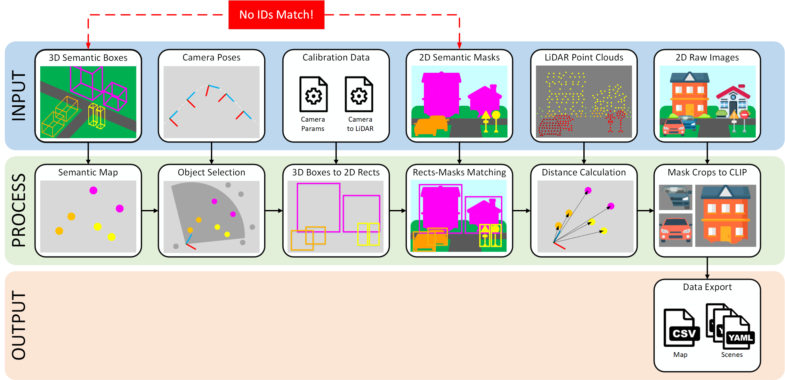

1. From 3D boxes Semantic map is created by determining center of each object in global coordinates.
1. For each camera pose, visible objects from the Semantic map are selected based on the camera's field of view and the maximum distance from the lidar.
1. 3D boxes of those objects are projected to bounding rectangles on camera plane by its calibration parameters.
1. 2D semantic masks are being matched with those rects by hungarian optimization of IoU score - there are global match of IDs is obtained.
1. Lidar points are projected to image plane, than points on object mask are selected, and distances to objects are calculated.
1. Raw images are used to obtain [CLIP](https://huggingface.co/openai/clip-vit-base-patch32) features, but first the image is cropped by its masks, filling extra areas with grey color.
1. All data exported in `.csv` and `.yaml` formats.

## Download prepared sequences

| Sequence | Objects in map | Scenes number | Submaps* | Video** | Files | Map with path |
|----------|----------------|------|----------------------|-------|-------|-----|
| 00       | 2333           | 9974 | 8, +22%                     | [youtube](https://youtu.be/A7bjzUIkK30?si=DuhxTbZS82iaXv9-) [rutube](https://rutube.ru/video/private/079623e768b9485d11debf8a1b0355bc/?p=Vlk90ysBleHwM_fXmewdWg) | [449.8](https://github.com/MoscowskyAnton/scene_recognition_kitti_360/releases/download/r0.0.2/seq00_submaps_save_06_08_17_26.tar.gz) MiB | 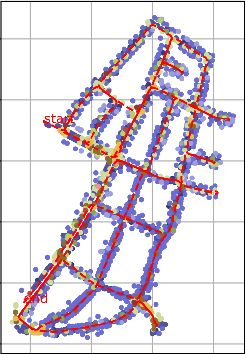 |
| 02       | 1720           | 8304 | 5, +7%                      | [youtube](https://youtu.be/jT7Wn0y4FLE?si=9eBE0xW7PHHE-ihG) [rutube](https://rutube.ru/video/private/4a0c569a1e471078fcf2d0f6681e8146/?p=oxqOT3iad3x8fqOtBy3kgg) | [214.4](https://github.com/MoscowskyAnton/scene_recognition_kitti_360/releases/download/r0.0.2/seq02_submaps_save_06_08_10_44.tar.gz) MiB | 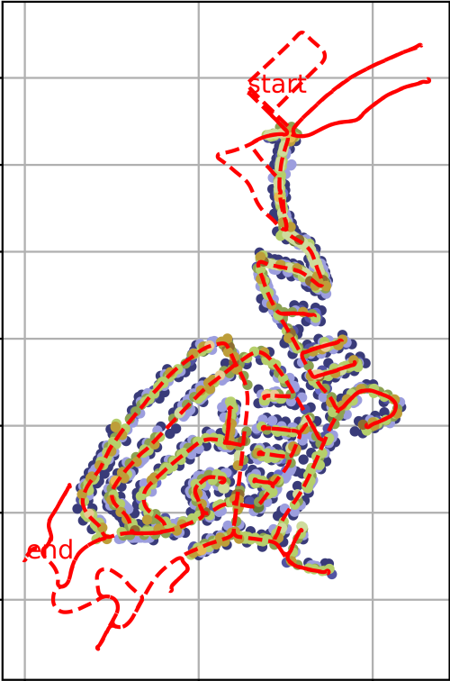|
| 03       | 133            | 453 | -                       | [youtube](https://youtu.be/OVBqgGdZYtw?si=XT9DPvKKqQ8ckaPL) [rutube](https://rutube.ru/video/private/97173034023d094a68c8f555e988ffc7/?p=SJbMwF824DIYOFul7wR5wA) | [10.4](https://github.com/MoscowskyAnton/scene_recognition_kitti_360/releases/download/r0.0.1/seq03_save_05_08_15_51.tar.gz) MiB | 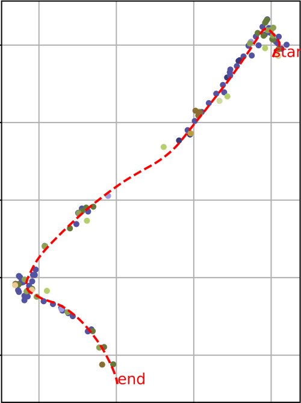|
| 04       | 1576           | 6892 | 6, +7%                     | [youtube](https://youtu.be/fmqJ-TL8iqw?si=NgYj95bnq70DVW9c) [rutube](https://rutube.ru/video/private/e1eaf0edbee38d69b4d8f3073db23008/?p=9mltukUZ4a5LKGUODdZSwg) | [188.3](https://github.com/MoscowskyAnton/scene_recognition_kitti_360/releases/download/r0.0.2/seq04_submaps_save_02_09_16_51.tar.gz) MiB | 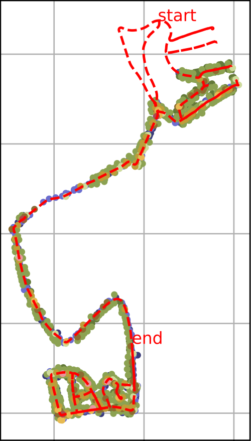|
| 05       | 830            | 4798 | 3, +8%                     | [youtube](https://youtu.be/S5s2bEjN-_U) [rutube](https://rutube.ru/video/private/27fd0ad8bafe75df249aeaede5d6b353/?p=gO7p2GKcr18_0ix2xxy_KA) | [122.7](https://github.com/MoscowskyAnton/scene_recognition_kitti_360/releases/download/r0.0.2/seq05_submaps_save_03_09_12_05.tar.gz) MiB | 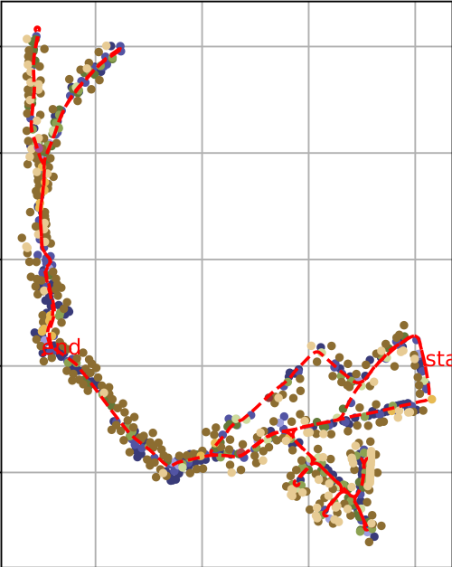|
| 06       | 1619           | 7552 | 6, + 14%                      | [youtube](https://youtu.be/Zd42YJ-Gwr0) [rutube](https://rutube.ru/video/private/b8dec24d2e1e9221b604072be2fd3fc0/?p=xmQpalRpr5_Y41_p7oqkvw) | [213.3](https://github.com/MoscowskyAnton/scene_recognition_kitti_360/releases/download/r0.0.2/seq06_submaps_save_03_09_12_06.tar.gz) MiB | 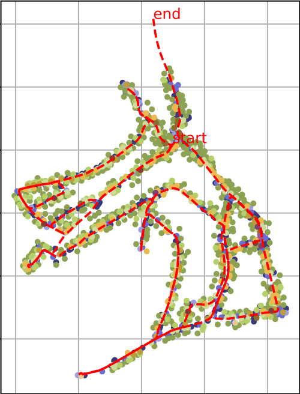|
| 07       | 476            | 1267 | -                     | [youtube](https://youtu.be/ykUggZw76AM?si=zZQBO-hTghY9vwP6) [rutube](https://rutube.ru/video/private/99f77f3dc27a2cfb1918e3ccce91b3fa/?p=n4m6Une_PVUcpar0BTsqGA) | [32.1](https://github.com/MoscowskyAnton/scene_recognition_kitti_360/releases/download/r0.0.1/seq07_save_06_08_14_27.tar.gz) MiB | 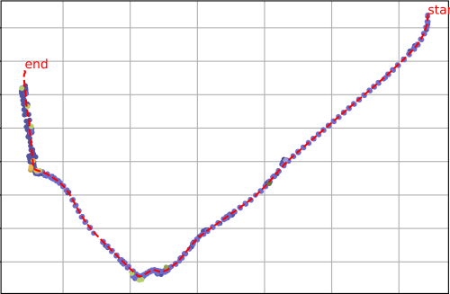|
| 09       | 1978           | 10330 | 5, +22%                     | [youtube](https://youtu.be/BwCCOVorgzg) [rutube](https://rutube.ru/video/private/ce1d8f211087803df3162e40817d6cd5/?p=CImUBPt_XhqPnm9Rt1KGRA) | [353.2](https://github.com/MoscowskyAnton/scene_recognition_kitti_360/releases/download/r0.0.2/seq09_submaps_save_03_09_12_11.tar.gz) MiB | 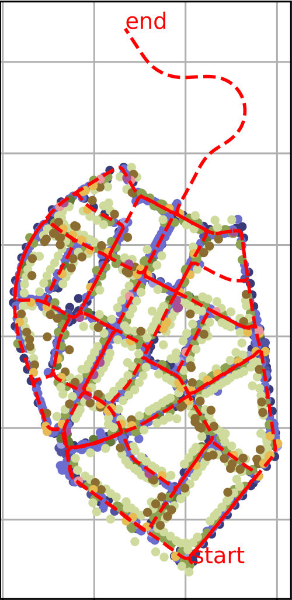|
| 10       | 1298           | 2174 | 3, +0%                     | [youtube](https://youtu.be/VubM0GEytj0) [rutube](https://rutube.ru/video/private/b1c1afcaf67833726da5b05b468ef4ba/?p=0Q7aTZM7BLv0PIPnqmoYRg) | [109.5](https://github.com/MoscowskyAnton/scene_recognition_kitti_360/releases/download/r0.0.2/seq10_submaps_save_03_09_17_11.tar.gz) MiB | 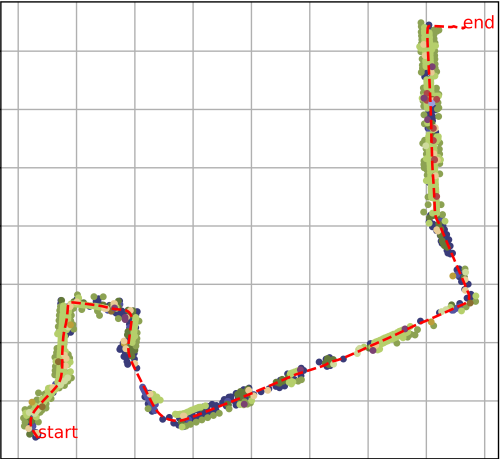|

\* - Number of submaps with total objects number increase.  
\*\* - on videos all visible objects - that are determined on step 2 - are marked, but those, which are with small mask or with small amount of lidar points are marked with gray color.

Each sequence has the following data:
 - Semantic map in `.csv` format. It contains object poses, its classes and global IDs, frames they were seen on and mean CLIP-features.
  
| gid | class | x | y | z | frames | mf0 | ... | mf511 |
|-----|-------|---|---|---|--------|-----|-----|-------|
| int |  str  | float | float | float | [int] as str | float | float | float |
 - `scenes` folder with scene data where each scene is stored as `.yaml` file. Each file has scene number, camera pose (in global frame) defined by transform, objects with classes, global IDs (matched with IDs in map), object poses (in camera frame) defined by lidar distances and angles on its mask's center, bounding rects and CLIP-features.
```yaml
frame_no: #int
objects:
  gid1: #int
    cam_pose: #[x, y, z] as floats - pose of object in camera frame
    features: #[x512] as floats
    label: #string
    lidar_dist_mean: #float
    lidar_dist_med: #float
    lidar_dist_min: #float
    lidar_dist_q1: #float
    lidar_dist_wavg: #float
    mask_angles: #[x, y] as floats
    rect: #[x1, y1, x2, y2] as ints
  ...
  gidN: ...
transform: # cam to map as 4x4 matrix
```
 - `.yaml` file with export params (see export script below).  
 - Map image with objects and track.
 - **[[new in r0.0.2]](https://github.com/MoscowskyAnton/scene_recognition_kitti_360/releases/tag/r0.0.2)** Added `submaps` folder for sequences with big maps. There are map is divided on smaller areas with intersection with each other. Each folder has a set of files named `semantic_submap_#.csv` in the same format as the main Semantic Map. Also has exported parameters, as well images, shown how submaps are organized. The script for division is also provided and documented below.

Also please note:
 - In all sequences next labels are **excluded**: driveway, fence, ground, pedestrian, railtrack, road, sidewalk, unknownConstruction, unknownGround, unknownObject, vegetation, wall, guardrail.
 - Scenes has only objects, that has enough (see params below) mask area as well enough lidar points in it. For that reason, some objects like lamps very rarery occur in scenes, because they are away from Lidar field of view.
 - Map has objects that have been detected in scenes at least once.
 - Scenes must have at least one object, frames with zero objects seen are excluded (even from videos).

## Or use provided script
### Installation
1. Clone this repository:
```bash
git clone https://github.com/MoscowskyAnton/scene_recognition_kitti_360
```
2. Install requirements:
```bash
pip3 install -r requirements.txt
```
3. Download [KITTI-360](https://www.cvlibs.net/datasets/kitti-360/download.php) stuff, you will need: 
 - Perspective Images (needed camera 0, it can be set in download script).
 - Semantics of Left Perspective Camera.
 - Raw Velodyne Scans.
 - 3D Bounding Boxes.
 - Calibrations.
 - Vechicle Poses.

### Usage

Run scripts with params tuned:
```sh
python3 scripts/semantic_map_and_scene_extractor.py --kitti_360_path ~/KITTI-360 --sequence 05 ...
```

 - **--kitti_360_path** (str, required) path to KITTI-360 folder.
 - **--save_path** (str, default: None) path to save data, if provided will create subfolder with name `scene_recogntion/sequence##/save_%d_%m_%H_%M`, if not provided such subdir will be created in `--kitti_360_path`.
 - **--sequence** (str, default: '00') chosen data sequence.
 - **--min_frame** (int, default: -1) Frame to start with, if -1 will starts from the very begining.
 - **--max_frame** (int, default: -1) Frame to end with, if -1 will go to the very end of sequence.
 - **--to_the_end** (bool, default: false) If set, will override inner object frame marking and will inspect all path to the end. Problem is that inner object marking in KITTI-360 may be with errors, and some objects seen again after some time may not be connected with current frame. This flag fixes that but increases time spent.
  - **--min_object_area_px** (int, default: 50) Masks with areas (in pixels) less than that value will be rejected (such object will not be added neither scene neither map).
  - **--max_object_dist_m** (float, default: 50) Objects further that that value will not be added to scene.
  - **--iou_cost_th** (float, default: 0.2) IoU threshold for mask-rect matching.
  - **--min_lidar_intensity** (float, defualt: 0.2) Lidar points with intensity value less that that will be discarded.
  - **--min_lidar_points** (int, defualt: 10) If object mask has less lidar points on it than that value, that object will be discarded from scene. Note that only points with intensity higher than **--min_lidar_intensity** encounted.
  - **--do_clip** (bool, default: false) If set, calculates CLIP features for objects.
  - **--objects_ignore** (list of str, default: empty) Set additional object labels for ignore.
  - **--save_map_unlabeled** (bool, default: false) If set saves image of map without object IDs.
  - **--save_map_labeled** (bool, default: false) If set saves image of map with object IDs. Result is OK only for small maps. For eg. limited with **--min_frame** and **--max_frame** params.
  - **--video_cam** (bool, default: false) If set, saves video from camera 0, where objects IDs, labels, rects and mask are drawn.
  - **--video_map** (bool, default: false) If set, saves top-down video where objects on scene are associated with map.
  - **--video_mix** (bool, default: false) If set, saves mixed video of camera 0 and top-down map. Examples of such videos are in links are given in the table above.
  - **--plot_invisible** (bool, default: false) If set, also draws discarded objects on current scenes. Such objects are drawn with grey color. Helps to understand why some of objects are not on scene.

Script also saves the params as `.yaml` file when running.

## Script for Map division
### Theory

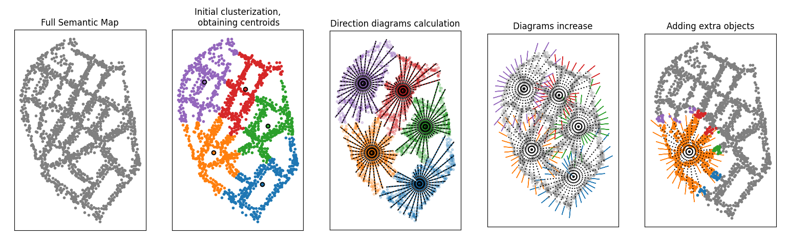
For obtaining submaps with intersections (overlaping), there following algorithm is proposed:
1. Do initial clustering (with AgglomerativeClustering), where `n_cluster=ceil(all_objects/submap_max_size)`. If some cluster exceeds `submap_max_size` it is clustered further.
1. Find cluster centers and calculate 'direction diagrams' for each center. Direction diagram is an array of maximum ranges from the center to cluster elements for each sector with the same fixed division angle.
1. Each sector in the direction diagram is extended beyond the last object of the cluster for a fixed distance `increase_range`. The objects of other clusters which fall within this extended sector are added to the main cluster.

### Usage
Run scripts with params tuned:
```python
python3 semantic_map_divider.py --path ~/Dataset/KITTI-360/KITTI-360/scene_recogntion/sequence09/save_03_09_12_11/ ...
```
  - **--path** (str, must be provided) Path to folder with sequence data, obtained with `semantic_map_and_scene_extractor.py` script.
  - **--submap_max_size** (int, default: 300) Max size of submaps in objects. 
  - **--increase_range** (float, default: 50) Range used to extend clusters.
  - **--dir_diag_size** (int, default: 32) Size of direction diagrams.
  - **--objects_ignore** (list of str, default: empty) Excludes objects from map.

Script also saves the params as `.yaml` file when running.
